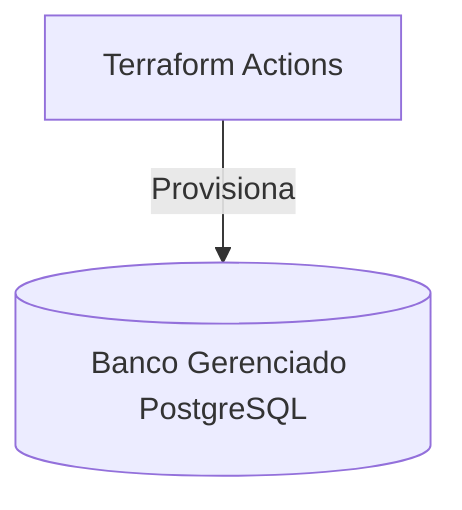

# Infraestrutura de Banco de Dados Gerenciado (Terraform)

## Descricao do Proposito
Responsavel por provisionar o banco de dados PostgreSQL Gerenciado (RDS) de forma isolada, garantindo que o ciclo de vida dos dados seja independente do ciclo de vida da aplicacao, permitindo backups automatizados e alta disponibilidade.

## Tecnologias Utilizadas
- Terraform
- PostgreSQL (AWS RDS / Cloud SQL)

## Passos para Execucao e Deploy
Deploy automatizado via GitHub Actions na `main`.
Para execucao manual:
1. `terraform init`
2. `terraform apply -auto-approve`

## Diagrama da Arquitetura Especifica

